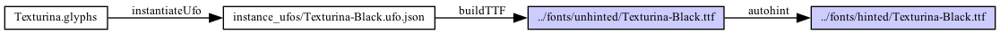

# gftools-builder: Config-driven font project builder

This utility wraps fontmake and a number of post-processing fixes to
build variable, static OTF, static TTF and webfonts from Glyphs,
Designspace/UFO or UFO sources, in a way that attempts to bring the
outputs close to the [Google Fonts guidelines](https://googlefonts.github.io/gf-guide/).

## Basic builds

The builder is driven by a configuration file in the [YAML](https://circleci.com/blog/what-is-yaml-a-beginner-s-guide/) format.
By convention, these files are placed in the `sources/` subdirectory
of your font repository, and are usually called `config.yaml`. (You can
give them different names if you have multiple families in the same
repository; `config.yaml` is just a convention. We'll look at building
multiple families later.)

The most basic configuration file simply tells the builder where to find
the font sources:

```yaml
sources:
    - Texturina.glyphs
    - Texturina-Italic.glyphs
```

To build this font family from the command line, use:

```shell
$ gftools builder sources/config.yaml
```

This will then build:

* Variable fonts for both sources, placing them in the `fonts/variable` directory; `gftools-fix` will be run on them, and they will have a STAT table build which relates the upright to the italic and vice versa.
* All static instances with TrueType outlines, in `fonts/ttf`. These will be autohinted, and `gftools-fix` will be run on them.
* All static instances with CFF outlines, in `fonts/otf`. `gftools-fix` will be run on them.
* Variable and static TTF WOFF2 webfonts, in `fonts/webfonts`.

In other words, the command above will produce 166 different outputs!

## Customizing the basic build process

A more complete YAML configuration file for the Texturina family would look like this:


```yaml
sources:
  - Texturina.glyphs
  - Texturina-Italic.glyphs
axisOrder:
  - opsz
  - wght
outputDir: "../fonts"
familyName: Texturina
version: 1.005
stat:
  - name: Width
    tag: wdth
    values:
    - name: UltraCondensed
      value: 50
      ...
  - name: Weight
    tag: wght
    values:
    - name: Regular
      value: 400
      flags: 2
    ...
instances:
  Texturina[wght].ttf:
  - coordinates:
      wght: 400
  - coordinates:
      wght: 500
  - familyName: "Texturina Exotic"
    styleName: "Medium"
    coordinates:
      wght: 500
    ...
  Texturina-Italic[wght].ttf:
  - coordinates:
      wght: 700
    ...
vttSources:
  Texturina[wght].ttf: vtt-roman.ttx
  Texturina-Italic[wght].ttf: vtt-italic.ttx
...
```

The build can be customized by adding the following keys to the YAML file:

-   `sources`: Required. An array of Glyphs, UFO or designspace source
    files.

-   `logLevel`: Debugging log level. Defaults to `INFO`.

-   `stat`: A STAT table configuration. This may be either a list of
    axes and values as demonstrated above, or a dictionary mapping each
    variable font to a per-source list. If neither `stylespaceFile` or
    `stat` are provided, a STAT table is generated automatically using
    `gftools.stat`. The Flags key's values are explained in the [OpenType
    spec](https://learn.microsoft.com/en-us/typography/opentype/spec/stat#flags).

-   `instances`: A list of static font TTF instances to generate from
    each variable font as demonstrated above. If this argument isn\'t
    provided, static TTFs will be generated for each instance that is
    specified in the source files.

-   `buildVariable`: Build variable fonts. Defaults to true.

-   `buildStatic`: Build static fonts (OTF or TTF depending on `$buildOTF`
    and `$buildTTF`). Defaults to true.

-   `buildOTF`: Build OTF fonts. Defaults to true.

-   `buildTTF`: Build TTF fonts. Defaults to true.

-   `buildWebfont`: Build WOFF2 fonts. Defaults to `$buildStatic`.

-   `outputDir`: Where to put the fonts. Defaults to `../fonts/`

-   `vfDir`: Where to put variable fonts. Defaults to
    `$outputDir/variable`.

-   `ttDir`: Where to put TrueType static fonts. Defaults to
    `$outputDir/ttf`.

-   `otDir`: Where to put CFF static fonts. Defaults to
    `$outputDir/otf`.

-   `woffDir`: Where to put WOFF2 static fonts. Defaults to
    `$outputDir/webfonts`.

-   `cleanUp`: Whether or not to remove temporary files. Defaults to
    `true`.

-   `autohintTTF`: Whether or not to autohint TTF files. Defaults to
    `true`.

-   `autohintOTF`: Whether or not to autohint OTF files. Defaults to
    `false`.

-   `ttfaUseScript`: Whether or not to detect a font\'s primary script
    and add a `-D<script>` flag to ttfautohint. Defaults to `false`.

-   `vttSources`: To patch a manual VTT hinting program (ttx format) to
    font binaries.

-   `familyName`: Family name for variable fonts. Defaults to family
    name of first source file.

-   `flattenComponents`: Whether to flatten components on export.
    Defaults to `true`.

-   `decomposeTransformedComponents`: Whether to decompose transformed
    components on export. Defaults to `true`.

-   `googleFonts`: Whether this font is destined for release on Google
    Fonts. Used by GitHub Actions. Defaults to `false`.

-   `category`: If this font is destined for release on Google Fonts, a
    list of the categories it should be catalogued under. Used by GitHub
    Actions. Must be set if `googleFonts` is set.

-   `fvarInstanceAxisDflts`: Mapping to set every fvar instance\'s
    non-wght axis value e.g if a font has a wdth and wght axis, we can
    set the wdth to be 100 for every fvar instance. Defaults to `None`

-   `expandFeaturesToInstances`: Resolve all includes in the sources\'
    features, so that generated instances can be compiled without
    errors. Defaults to `true`.

-   `reverseOutlineDirection`: Reverse the outline direction when
    compiling TTFs (no effect for OTFs). Defaults to fontmake\'s
    default.

-   `removeOutlineOverlaps`: Remove overlaps when compiling fonts.
    Defaults to fontmake\'s default.

-   `glyphData`: An array of custom GlyphData XML files for with glyph
    info (production name, script, category, subCategory, etc.).
    Used only for Glyphs sources.

-   `includeSourceFixes`: Whether to pass the `--include-source-fixes`
    argument when fixing the fonts. Defaults to true.

-   `checkCompatibility`: Check the compatibility of outlines before building
    a variable font. Defaults to true.

-   `extraFontmakeArgs`: A string of additional arguments to pass to
    `fontmake` when building all fonts.

-   `extraVariableFontmakeArgs`: A string of additional arguments to pass to
    `fontmake` when building variable fonts.

-   `extraStaticFontmakeArgs`: A string of additional arguments to pass to
    `fontmake` when building static fonts.

-   `buildSmallCap`: Automatically build smallcap families from source with a
    `smcp` feature. Defaults to true.

-   `splitItalic`: For variable fonts containing a `slnt` or `ital` axis,
    subspace them into separate roman and italic VF files to comply with
    Google Fonts' specification. Defaults to true.

-   `localMetadata`: A field that's ignored so you can put whatever you like in it.

-   `filenameSuffix`: A suffix appended to the family name part of filenames.

-   `postCompile`: A list of operations to be run after the font compilation step; you can use this (together with the above option) to build variant fonts, rename families, bake in stylistic sets, etc.


## *Really* customizing the build process

If the options above aren't enough for you - let's say you want to run your
own post-processing script, or you're creating multiple versions of the same
font and using `pyftfeaturefreeze` or remapping the cmap table, or you want
to use `paintcompiler` to make a COLRv1 variant, ... or you just need to do
things differently - then you can provide the builder with a *recipe*.

By default, the builder takes the configuration you give it and applies a
*recipe provider*. The default recipe provider is `googlefonts`,
so a basic configuration file is equivalent to

```yaml
sources:
    - Texturina.glyphs
    - Texturina-Italic.glyphs
recipeProvider: googlefonts
```

This recipe provider (implemented in the Python module
`gftools.builder.recipeproviders.googlefonts`) reads the configuration
and determines the target files to build and the steps to take in order
to build them, and under the hood, it adds a *recipe* to the
configuration.

Hence, to fully customize the build process, your configuration file
can provide its own recipe. This can be done in two ways: (1) If you
add a `recipe` map to your config file *without* specifying a
`recipeProvider`, then your provided recipe is what gets built. (2)
If you add a `recipe` map *and* specify a `recipeProvider`, the
recipe provider generates a recipe first, and your recipe is then
overlaid on top of it, allowing you to customize certain targets
or add additional ones.

To see the recipe that it generates internally, you can use the `--generate`
flag, like so: `gftools builder --generate sources/config.yaml`;
this will emit a new configuration file, with the recipe attached:

```yaml
sources:
- Texturina.glyphs
- Texturina-Italic.glyphs
recipeProvider: googlefonts
recipe:
  ../fonts/otf/Texturina-Black.otf:
      - source: Texturina.glyphs
      - operation: instantiateUfo
        instance_name: Texturina Black
      - operation: buildOTF
        args: --filter ...  --filter FlattenComponentsFilter --filter DecomposeTransformedComponentsFilter
      - operation: fix
  ../fonts/otf/Texturina-BlackItalic.otf:
      - source: Texturina-Italic.glyphs
      - operation: instantiateUfo
        instance_name: Texturina Black Italic
        ...
```

> (I've slightly reordered this file from the *actual* output that you
would get, in order to make it easier to follow, but the contents are
equivalent.)

As you can see, a recipe maps a *target* to a number of *steps*. Each step
begins with a *source* and consists of a number of *operations*, each of
which can have arguments. Files are passed from operation to operation, with the builder determining any temporary file names needed.

> Two additional possibilities, for completeness:
> 1) You can also switch sources midway through if an operation created a new source.
> 2) Optionally, the steps can end with one or more *postprocess* steps.
> We'll talk about those later.

The builder will then look at the list of targets and steps, and determine
the most efficient way to build the targets, so you don't need to attempt
to optimize the build process yourself. This might mean that the list of
steps you give seem duplicative. For example, if you want to build
unhinted and hinted versions of a font, you might say:

```yaml
recipe:
  ../fonts/unhinted/Texturina-Black.ttf:
      - source: Texturina.glyphs
      - operation: instantiateUfo
        instance_name: Texturina Black
      - operation: buildTTF
  ../fonts/hinted/Texturina-Black.ttf:
      - source: Texturina.glyphs
      - operation: instantiateUfo
        instance_name: Texturina Black
      - operation: buildTTF
      - operation: autohint
```

With this recipe, the builder will *not* create an instance UFO and
build a TTF, then create another instance UFO and build a TTF again and
run autohint on it. Instead, it will realise that it can first build
`../fonts/unhinted/Texturina-Black.ttf`, and then it can get from there
to `../fonts/unhinted/Texturina-Black.ttf` by running an autohinter.

In fact, if you have the `pydot` package installed, you can run
`gftools-builder --graph sources/config.yaml` and it will illustrate its
build process by leaving a `graph.png` file in the `sources` directory:



### Operations available

"Operations" are implemented as Python classes under the package
`gftools.builder.operations`. Currently provided operations include
(in rough order of frequency of use):

- *buildVariable*: Runs `fontmake -o variable` on the input file. Any `args` are added to the fontmake command line.
- *buildTTF* and *buildOTF*: Analogously runs `fontmake -o ttf` and `fontmake -o otf`
- *instantiateUFO*: Creates an interpolated UFO for a given `instance_name`.
- *autohint*: Runs `gftools-autohint` on a TTF.
- *buildStat*: *Postprocesses* one or more variable fonts to add a STAT table to them.
- *fix*: Runs `gftools-fix` on a binary font.
- *compress*: Creates a WOFF2 web font.
- *rename*: Renames a font's family name to the provided `name` argument.
- *exec*: An escape hatch for arbitrary processing - executes the executable named in the `exe` argument with the arguments provided in `args`.
- *copy*: Copies a file. Used internally when generating multiple variants from the same intermediate file.
- *featureFreeze*: Runs `pyftfeaturefreeze` with the arguments provided in `args`.
- *subspace*: Runs `fonttools varLib.instancer` to subspace a variable font according to the values in `axes`. `args` are added to the command line.
- *hbsubset*: Uses `hb-subset` to slim down a font binary.
- *addSubset*: Adds a subset from another font using `gftools-add-ds-subsets`
    - `directory`: the intermediary folder used to store the source(s) the subset(s) is taken from
    - `subsets`: a list of subset configurations to merge in
        - `from` (required): can be a pre-configured Noto source ("Noto Sans", "Noto Serif", "Noto Sans Devanagari", "Noto Sans Linear B"), or:
            - `repo`: the GitHub slug for the repository, e.g. `googlefonts/gftools`. You can specify a git revision by suffixing this with `@v1.0.0`, or use `@latest` for the latest *published* release
            - `path`: the path within the repo that has the source file
        - `name`: a named Google Fonts subset, e.g. `GF_Latin_Core`
        - `ranges`: a list unicode codepoint range to include
            - `start`: the start of the range (as hex or decimal)
            - `end`: the end of the range (as hex or decimal)
        - `layoutHandling`: "subset", "closure" or "ignore" ([further reading](https://github.com/googlefonts/ufomerge/blob/bb9a82ff3039b8aa0cba58372158bd3c0e5cb770/Lib/ufomerge/__init__.py#L512-L521))
        - `force`: replace existing glyphs in your sources, instead of skipping them
        - `exclude_glyphs`: whitespace-delimited glyph names to exclude from merging
        - `exclude_glyphs_file`: path to a file with glyphs names to exclude from merging, one per line (comments using `#` or `//` allowed)
        - `exclude_codepoints`: whitespace-delimited unicode codepoints to exclude from merging
        - `exclude_codepoints_file`: path to a file with with unicode codepoints to exclude from merging, one per line (comments using `#` or `//` allowed)
- *buildVTT*: Uses `gftools-build-vtt` with the configuration file provided in `vttfile` to add VTT hinting to a font binary.
- *remap*: Uses `gftools-remap-font` to alter a font binary's `cmap` table.
- *paintcompiler*: Runs paintcompiler on a font to add a COLRv1 table.

### Switching sources

In some cases, an operation can run on a source file to produce a different
source. If the builder knows about this (such as when running the 
*instantiateUFO* operation), all is well. But if you are using the *exec*
operation to do things the builder is not aware of, you will need to tell
the builder about the new source file so that it can carry on from there:

```yaml
Handwriter-Guides.ttf:
    - source: Handwriter.glyphs
    - operation: exec
      exe: python3 ../scripts/add-guidelines.py
      args: -o Handwriter-Guidelines.glyphs Handwriter.glyphs
    - source: Handwriter-Guidelines.glyphs
    - operation: buildTTF
```

### Post-processing and dependencies

The STAT table produces an interesting challenge, in two ways. Let's take
the case of Texturina, with upright and italic source files:

```yaml
sources:
    - Texturina.glyphs
    - Texturina-Italic.glyphs
```

After building the two variable fonts, we then want to use
`gftools-build-stat` to link them together via the `STAT` table.
`gftools-build-stat` takes a number of font binaries and modifies them
in-place. This means that we can only run the `buildSTAT` operation
after *both* targets have been completely built. The way that the
`googlefonts` recipe provider achieves this is to add the following
*postprocessing* step to one of the files. Somewhere in the generated
recipe, you will find this:

```yaml
  ../fonts/variable/Texturina-Italic[opsz,wght].ttf:
      - source: Texturina-Italic.glyphs
      - operation: buildVariable
        ...
      - operation: fix
      - postprocess: buildStat
        needs:
            - ../fonts/variable/Texturina[opsz,wght].ttf
```

This last step (a) uses the `needs` key to declare a dependency on
another target - in other words, this step can only be run once
`../fonts/variable/Texturina[opsz,wght].ttf` has been fully generated,
and (b) uses `postprocess` instead of `operation` to declare that the
input file and output file are the same. The builder will then ensure
that the operation is only called when both variable fonts are built.

### Creating your own recipe provider

If you have multiple families you want to build in the same way, or if
you just have a *really* complex build process, then you can create
your own recipe provider as a Python module. To do this, create a Python
file containing a single class inheriting from
`gftools.builder.recipeproviders.RecipeProviderBase`, and implement a
`write_recipe` method.

This method is expected to read `self.config`, a Python object
representing the YAML configuration file, and return a Python dictionary
similar to the `recipe` entry. You can use
`gftools.builder.recipeproviders.googlefonts` and
`gftools.builder.recipeproviders.noto` as inspiration.

Finally ensure that your Python file is in your Python module load path,
and add the name of the module to your config file:

```
sources:
  - Texturina.glyphs
  - Texturina-Italic.glyphs
recipeProvider: texturina
```

This will load `texturina.py` (or `texturina/__init__.py`), find an
appropriate subclass, and use that to derive the recipe.
