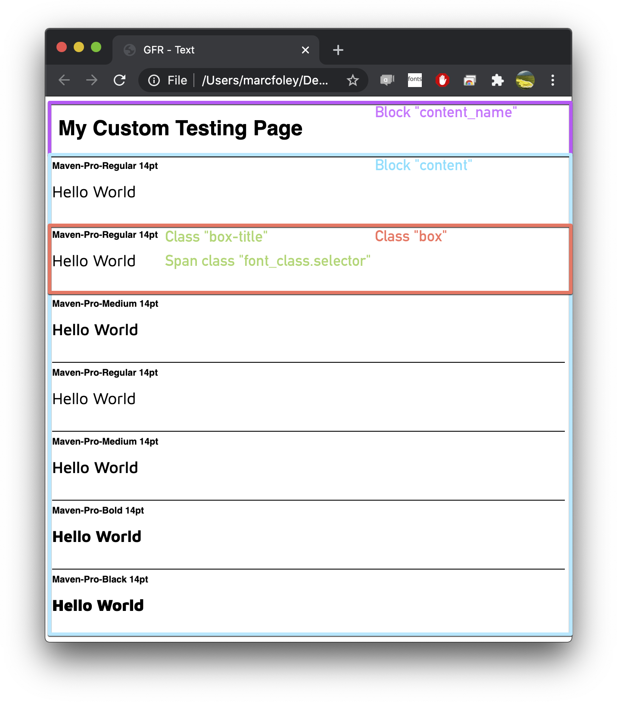

# gftools gen-html

Generate html test documents for font families using custom templates.


## Quick start

By default, `gftools gen-html` provides a few built-in templates. To generate these, run:

`gftools gen-html proof path/to/fonts/*.ttf -o out`

If you would like to diff two sets of fonts using these templates:

`gftools gen-html diff --fonts-before path/to/fonts/before/*.ttf --fonts-after path/to/fonts/after/*.ttf -o out`

`-fb` can be used instead of `--fonts-before` and `-fa` can be used instead of `--fonts-after`


## Features

- Templates are constructed using the [jinja2](https://jinja.palletsprojects.com/en/2.11.x/) templating language
- Compare static fonts against variable font fvar instances. Fonts and instances are matched by full names
- Take screenshots using Browserstack
- Flexible design which will allow foundries to write their own templates/expansions
- No need to worry about local servers since these are included and are automatically started/stopped when running the tool


## Writing custom templates

The quickest way to start writing your own templates is to copy the existing [templates](https://github.com/googlefonts/gftools/tree/main/Lib/gftools/templates) directory in gftools and add make amendments. When executing the tool with custom templates, the new template directory needs to be passed using the argument `--template-dir path/to/my/template dir` e.g:

`gftools gen-html proof path/to/my/fonts/*.ttf -o out --template-dir my_custom_templates/`


### A minimal example


```HTML
<!-- First, we need to include the base html page. This page includes the css, -->
<!-- @font-faces and basic page layout. We can modify this page freely if needed. -->


<!-- Block title sets the title of our page -->
Text


<!-- With the metadata taken care of, we can now start defining the content of our page. -->

<!-- We need to create a name for our page in the content_name block. This is visible to users -->
 //
<b>My Custom Testing Page</b> <!-- Title of page -->


<!-- The content block as the name suggests contains our content. -->


  <!-- This loop will iterate through the css_font_classes which are contained in the -->
  <!-- ProofHtml and DiffHtml objects -->
  

      <!-- Class "box" is a content container -->
      <div class="box"> 

	<!-- Class box-title is the visible name of each container e.g "MyFont-regular 32pt"  -->
	<div class="box-title">{{ font_class.selector }} {{ pt_size }}pt</div>

	<!-- Class font_class.selector applies the currently iterated font style to child elements -->
	<span class="{{ font_class.selector }}" style="font-size: {{ pt_size }}pt">
	  Hello World <!-- our Hello world text -->
          </span>

       </div> <!-- Closes div class="box" -->

    

```

Once generated, we should end up with the following for Maven Pro.

`gftools gen-html proof google/fonts/ofl/mavenpro/*.ttf -o ~/Desktop/mavenPro_qa --template-dir templates/`




### Defining your own template generation classes

If you need further flexibilty, you can create a new class which inherits `gftools.html.HtmlTemplater`. This class provides the following functionality out of the box:
- Font matching
- A screenshotter for Browserstack
- Ability to start daemon server.

To write your own class, it is worth studying the existing `HtmlProof` and `HtmlDiff` classes.

