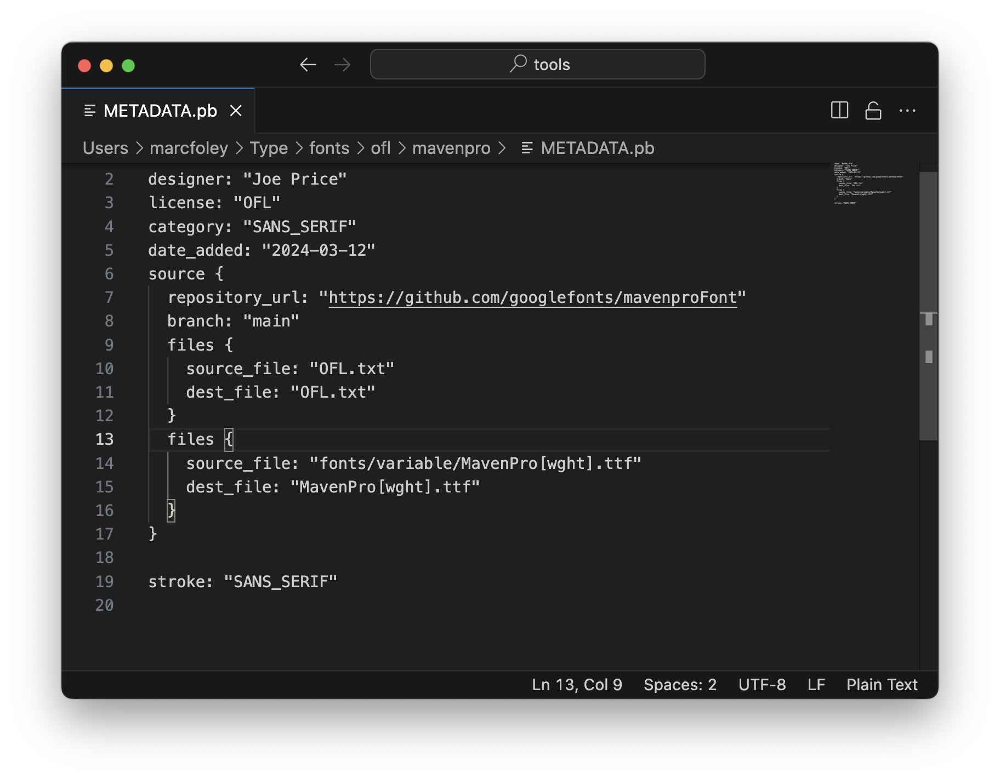
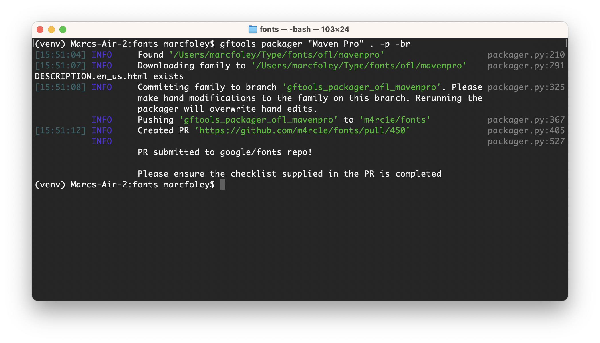

# gftools packager


Push upstream font families to the `google/fonts` [repository](https://github.com/google/fonts).

```
usage: gftools [-h] [-p] [-br BASE_REPO] [-hr HEAD_REPO] [-l {ofl,apache,ufl}] [--latest-release] [--log-level {DEBUG,INFO,WARNING,ERROR,CRITICAL}]
[--skip-tags]
family_name repo_path

positional arguments:
    family_name           Name of font family or path to a METADATA.pb file
    repo_path             Path to the google/fonts repository

options:
    -h, --help            show this help message and exit
    -p, --pr              Open a pull request on google/fonts or a forked repo
    -br BASE_REPO, --base-repo BASE_REPO
                        Repo owner to send pull request. Default is 'google'
    -hr HEAD_REPO, --head-repo HEAD_REPO
                        Repo owner to push branch. Default is 'google'
    -l {ofl,apache,ufl}, --license {ofl,apache,ufl}
                        licence type for new family
    --latest-release      Get assets from latest upstream release
    --log-level {DEBUG,INFO,WARNING,ERROR,CRITICAL}
    --skip-tags

```

## Pushing a new family

Let's push [Maven Pro](https://github.com/googlefonts/mavenproFont).


1. In the terminal, navigate to your local `google/fonts` repo:

`cd path/to/your/google/fonts`

2. run gftools packager with the following command:

`gftools packager "Maven Pro" . -p`

Here's a breakdown of the arguments:

- `Maven Pro` is the family name. We can also provide a path to a family's metadata file instead e.g `path/to/google/fonts/ofl/mavenpro/METADATA.pb`.
- `.` is the directory to our local `google/fonts` repo. We can actually run the tool from any directory.
- `-p` Opens a pull request in `google/fonts`. This argument is optional.

Once you've run the tool, you'll get the following message:


3. Open the newly generated METADATA.pb file in your favorite text editor and populate the newly added `source` fields.



4. Rerun the last command in your terminal and you should now have the following message:




5. Please inspect the newly created PR and complete the items on the checklist. If you need to make any modifications to description files or METADATA.pb files, `git checkout` the branch and do them by hand. If you rerun the packager it will overwrite any hand edited files that are listed in the METADATA.pb file.


## Pushing an updated family

Use the same commands in the previous quick start. Since the `METADATA.pb` file has source fields, you won't need to run the tool twice.

## Tips

- Set your favorite editor to open `METADATA.pb` by default. On Mac, this allows you to open them up from your terminal `open path/to/METADATA.pb`
- On Mac, you can command+click on urls in the terminal and it will open them in your web browser ;-)
